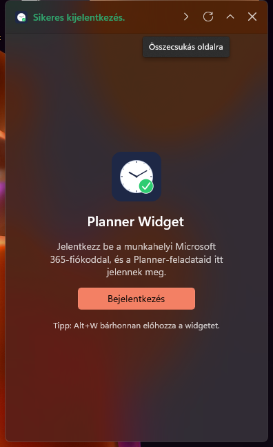
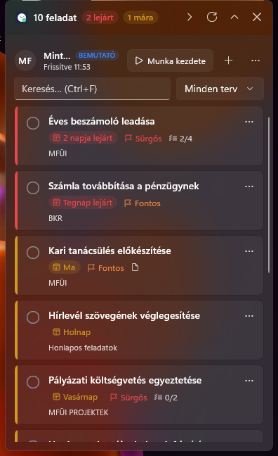
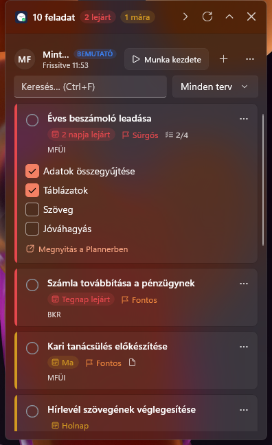
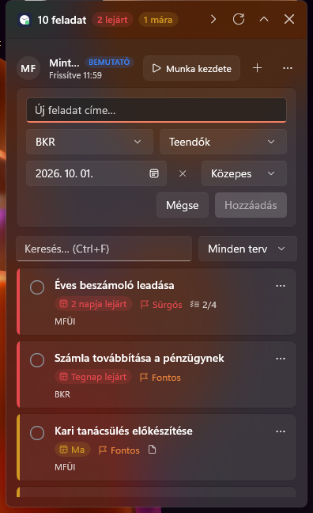
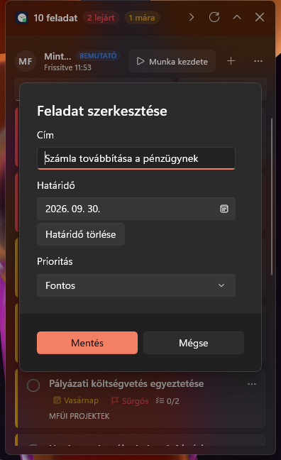
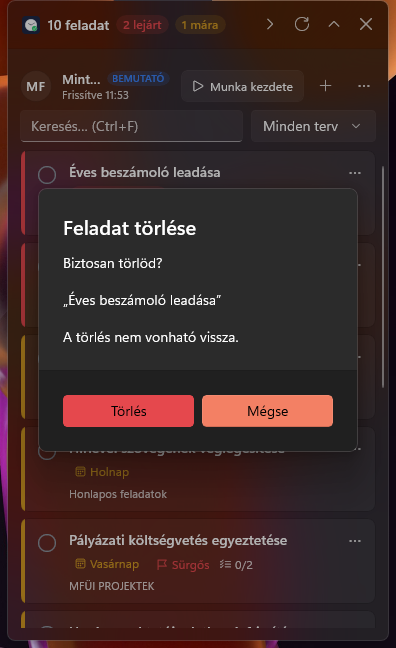
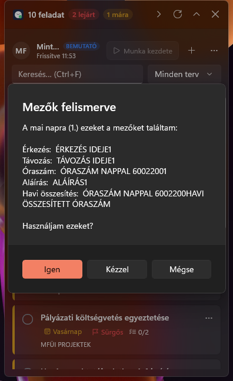
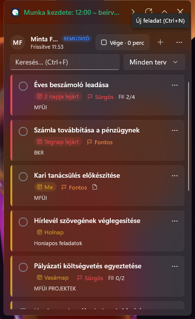
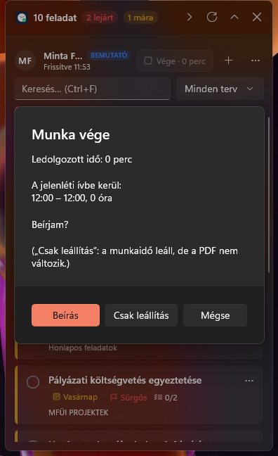
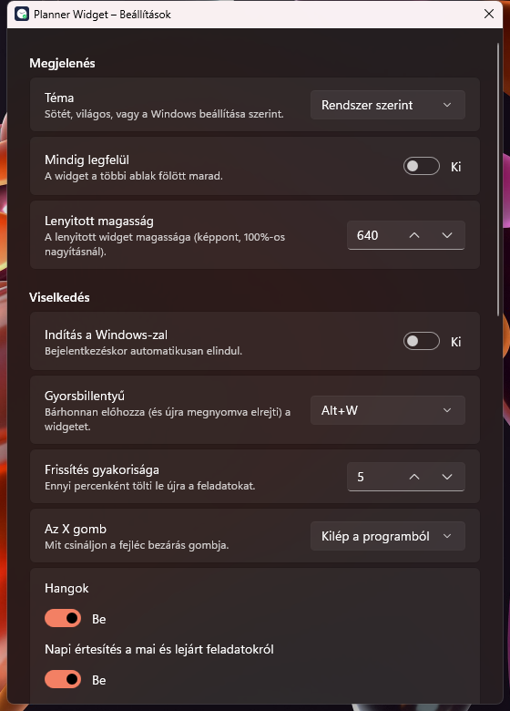

# Planner Widget – Útmutató

Lépésről lépésre: az első indítástól a napi használaton és a jelenléti íven át a saját módosításokig.
(A képek a beépített **bemutató módból** készültek, kitalált feladatokkal.)

**Tartalom**

1. [A mappa felépítése](#1-a-mappa-felépítése)
2. [Első lépések](#2-első-lépések)
3. [A widget használata](#3-a-widget-használata)
4. [Munkaidő és jelenléti ív](#4-munkaidő-és-jelenléti-ív)
5. [Beállítások](#5-beállítások)
6. [Frissítés, eltávolítás](#6-frissítés-eltávolítás)
7. [Hibaelhárítás](#7-hibaelhárítás)
8. [Fejlesztőknek: saját módosítások](#8-fejlesztőknek-saját-módosítások)

---

## 1. A mappa felépítése

| Mi | Mire való |
|---|---|
| **`Bemutató.cmd`** | Dupla kattintás: kipróbálás kitalált adatokkal. Semmi nem kerül a Plannerbe, a PDF-et nem írja. |
| **`Indítás.cmd`** | Dupla kattintás: lefordítja és elindítja a valódi widgetet (a te feladataiddal). |
| **`Telepítés.cmd`** | Dupla kattintás: végleges telepítés + Start menü és asztali parancsikon. |
| `UTMUTATO.md` | Ez a leírás. |
| `README.md` | Rövid összefoglaló (funkciók, adatok helye). |
| `docs/kepek/` | Az útmutató képei. |
| `scripts/` | A fenti `.cmd` fájlok mögötti PowerShell-szkriptek (+ teszt, eltávolítás). |
| `src/` | A forráskód: `PlannerWidget.Core` (logika) és `PlannerWidget.App` (felület). |
| `tests/` | Automatikus tesztek. |
| `PlannerWidget.sln` | A megoldásfájl – ezt nyisd meg Visual Studióban / VS Code-ban. |
| `CLAUDE.md` | Jegyzet a Claude-nak (AI-asszisztens) a projektről. |
| `global.json`, `nuget.config`, `Directory.Build.props`, `.gitignore` | Fordítási beállítások – nem kell hozzájuk nyúlni. |

A fordítás eredménye **nem** ebbe a mappába kerül (hogy a OneDrive ne szinkronizáljon több ezer generált fájlt), hanem ide:
`%LOCALAPPDATA%\PlannerWidget.Build`.

**Ami kell hozzá:** Windows 10/11 és a .NET 10 SDK (ez már telepítve van a gépeden). Más gépre:
<https://dotnet.microsoft.com/download> → .NET 10 SDK, vagy PowerShellben `winget install Microsoft.DotNet.SDK.10`.

---

## 2. Első lépések

> **Ha a kész programot töltötted le** (GitHub → Releases → `PlannerWidget-v3.0-win-x64.zip`), nem kellenek a `.cmd` fájlok
> és a .NET SDK sem: csomagold ki egy állandó helyre, indítsd el a `PlannerWidget.exe`-t, és folytasd a 2.2-es ponttal.
> Bemutató módban így indítható: `PlannerWidget.exe --demo`.

### 2.1 Kipróbálás (bemutató mód)

Kattints duplán a **`Bemutató.cmd`**-re. Az első fordítás kb. fél perc, utána pár másodperc. A widget a képernyő jobb felső
sarkában jelenik meg, kitalált feladatokkal, a neved mellett **BEMUTATÓ** címkével. Nyugodtan kattintgass:
semmi nem kerül a Plannerbe.

### 2.2 Valódi használat, bejelentkezés

Kattints duplán az **`Indítás.cmd`**-re. Első alkalommal ez a kép fogad:



1. Kattints a **Bejelentkezés** gombra – megnyílik a böngésző a Microsoft bejelentkezéssel.
2. Válaszd a munkahelyi fiókodat (`…@sze.hu`). Ha a böngésző kiírja, hogy *Sikeres bejelentkezés*, a lapot bezárhatod.
3. A widget pár másodperc alatt betölti a feladataidat.

A bejelentkezés titkosítva megmarad – legközelebb már nem kérdez.

### 2.3 Végleges telepítés

Ha tetszik, kattints duplán a **`Telepítés.cmd`**-re. Ez:

- készít egy optimalizált (gyorsabban induló) változatot,
- feltelepíti ide: `%LOCALAPPDATA%\Programs\PlannerWidget` (rendszergazdai jog nem kell),
- készít **Start menü** és **asztali** parancsikont („Planner Widget”), majd elindítja.

Ezután már nem kell a `.cmd` fájlokat használnod: a Start menüből indítsd. Ha azt szeretnéd, hogy bejelentkezéskor
magától induljon: **Beállítások → Indítás a Windows-zal**.

> A beállításaid és a bejelentkezésed közösek a fejlesztői (`Indítás.cmd`) és a telepített változat között.

---

## 3. A widget használata



### 3.1 A fejléc

| Elem | Jelentés |
|---|---|
| **10 feladat** | Aktív (nem kész) feladataid száma |
| **2 lejárt** (piros) | Ennyinek a határideje elmúlt |
| **1 mára** (sárga) | Ennyi ma esedékes |
| `>` | Oldalra csukás (kompakt mód) |
| `↻` | Frissítés (amúgy 5 percenként magától is frissül) |
| `˄` / `˅` | Lenyitás / becsukás (csak a fejléc marad) |
| `×` | Kilépés (a Beállításokban átállítható „elrejtés a tálcára”-ra) |

A widgetet a **fejléc szövegénél fogva** tudod mozgatni; a helyét megjegyzi. Rövid üzenetek (pl. „Kész ✓”) is itt jelennek meg.

Alatta: a neved, az utolsó frissítés ideje, a **Munka kezdete** gomb, az **+** (új feladat) és a **⋯** menü
(Megnyitás a Plannerben, Beállítások, Kijelentkezés, Kilépés).

### 3.2 A feladatkártyák

| Bal oldali sáv | Jelentés |
|---|---|
| 🟥 piros | Lejárt |
| 🟨 sárga | Ma vagy 7 napon belül esedékes |
| 🟩 zöld | Később esedékes |
| ⬜ szürke | Nincs határideje / kész |

A kártyán: **cím**, határidő („Ma”, „Holnap”, „2 napja lejárt”, „Szombat”, „okt. 13.”), **prioritás**
(🚩 Sürgős / Fontos / Alacsony – a „Közepes”-t nem jelzi), **ellenőrzőlista** állása (pl. 2/4),
📄 ha van leírása, és alul a **terv** neve. Sorrend: lejárt → ma/hamarosan → később → határidő nélkül.

- **Kész jelölés:** kattints a bal oldali **karikára** ○ – hang szól, a feladat átkerül a „Kész feladatok” közé.
  Ott a zöld pipára kattintva visszanyitható.
- **Részletek:** kattints a kártya **szövegére** – kinyílik a leírás és az **ellenőrzőlista**, amit itt is kipipálhatsz:



### 3.3 Új feladat

Kattints az **+**-ra (vagy `Ctrl+N`):



Írd be a címet, válaszd ki a **tervet** és az **oszlopot** (bucket), a határidőt (alapból ma – a naptárral
módosítható, a mellette lévő **✕**-szel törölhető, ha nem kell) és a prioritást, majd **Hozzáadás** (vagy `Enter`).
A program tervenként megjegyzi, melyik oszlopot választottad utoljára.

### 3.4 Szerkesztés és törlés

A kártya jobb felső **⋯** gombja: *Szerkesztés…*, *Részletek*, *Megnyitás a Plannerben*, *Törlés*.

| Szerkesztés | Törlés |
|---|---|
|  |  |

A törlés előtt mindig rákérdez (kikapcsolható a Beállításokban). Az `Enter` itt biztonságból a **Mégse**.

### 3.5 Keresés, szűrés, kész feladatok

- A **Keresés** mezőbe írva (`Ctrl+F`) a címre és a terv nevére szűr.
- A mellette lévő listában egy **tervre** szűrhetsz.
- A lista alján a **Kész feladatok (N)** lenyitható, 12-esével lapozható; a legutóbb befejezett van elöl.

### 3.6 Méretek, tálcaikon, gyorsbillentyű

| Csak fejléc (`˄`) | Oldalra csukva (`>`) |
|---|---|
|  |  |

- **Gyorsbillentyű: `Alt+W`** – bárhonnan előhozza és lenyitja a widgetet; ha már elöl van, újra megnyomva elrejti.
  (Ha a régi Python-widget fut, az foglalja az `Alt+W`-t – zárd be.)
- **Tálcaikon** (a jobb alsó sarokban, a `^` alatt is lehet):
  bal klikk = megjelenítés / elrejtés, jobb klikk = menü (Frissítés, Új feladat, Munka kezdete/vége, Beállítások, Kilépés).
- Ha nem vagy a gépnél, offline is megmutatja az utolsó letöltött állapotot, és magától újra próbálkozik.
- Reggel 7 után az első frissítéskor Windows-értesítést kapsz, ha van mára vagy lejárt feladat (kikapcsolható).

### 3.7 Billentyűparancsok

| Billentyű | Művelet |
|---|---|
| `Alt+W` | Widget elő / el (bárhonnan) |
| `F5` | Frissítés |
| `Ctrl+N` | Új feladat |
| `Ctrl+F` | Keresés |
| `Enter` | (a címmezőben) feladat hozzáadása |
| `Esc` | Panel bezárása → keresés törlése → összecsukás |

---

## 4. Munkaidő és jelenléti ív

A **Munka kezdete / Munka vége** gomb a havi jelenléti ív PDF-jébe írja a munkaidődet – pont úgy, mintha kézzel töltötted volna ki.

### 4.1 Első használat

A régi verzióból átvett beállításokkal a PDF helye és a mezők már ismertek. Ha nincsenek (vagy új ívet választasz),
a program megkérdezi a PDF-et, és **felismeri a mezőket**:



Ellenőrizd, hogy a mai napod sorát találta-e meg (Érkezés / Távozás / Óraszám / Aláírás), és nyomd meg az **Igen**-t.
Ha nem stimmel, a **Kézzel** gombbal egy kereshető listából választhatod ki a mezőket.

### 4.2 Munka kezdete

Kattints a **Munka kezdete** gombra. Az érkezés a **legközelebbi egész órára kerekítve** kerül a PDF-be
(8:29 → 8:00, 8:30 → 9:00), a fejlécben pedig rövid visszajelzést kapsz. A gombon látszik az eltelt idő:



A futó munkaidő a program bezárása / a gép újraindítása után is megmarad.

### 4.3 Munka vége

Kattints a **Vége · …** gombra. Összefoglalót kapsz arról, mi kerül az ívbe:



- **Beírás:** beírja a távozást, az óraszámot, az aláírást (a neved) és újraszámolja a **havi összesítést**.
- **Csak leállítás:** leállítja a mérést, a PDF nem változik (pl. ha kézzel írod be).
- **Mégse:** a munkaidő tovább fut.

### 4.4 Hónapváltás

Az ív havonta új fájl (pl. `…\2026. március\Név_Jelenléti_március.pdf`). Új hónapban a program magától megkeresi
ugyanott az aktuálisat (`…\2026. október\Név_Jelenléti_október.pdf`), és felajánlja az átváltást.
Ha még nincs fent a hálózati meghajtón, szól, és választhatsz másikat (vagy maradhat a régi).

### 4.5 Ha valami nem stimmel

- **„A PDF nyitva van egy másik programban”** – zárd be az ívet az Acrobatban / Edge-ben, és nyomd meg újra a gombot.
  A munkaidő addig tovább fut.
- **Nem érhető el a hálózati meghajtó** – VPN / belső hálózat kell. A munkaidő akkor is mérhető („Indítás így”), a beírás pótolható.
- **Rossz mezőbe ír** – Beállítások → Jelenléti ív → *Mezők újrabeállítása*.
- **Elfelejtetted leállítani** – Beállítások → Jelenléti ív → *Munkaidő törlése* (beírás nélkül leállítja).

---

## 5. Beállítások

**⋯ → Beállítások…** (vagy a tálcaikon menüjéből). Minden változás azonnal érvényes.



| Beállítás | Mit csinál |
|---|---|
| Téma | Sötét / világos / a Windows szerint |
| Mindig legfelül | A widget a többi ablak fölött marad |
| Lenyitott magasság | Ha több vagy kevesebb feladatot szeretnél egyszerre látni |
| Indítás a Windows-zal | Bejelentkezéskor magától indul |
| Gyorsbillentyű | `Alt+W`, `Ctrl+Alt+P`, `Ctrl+Shift+Space`, `Win+Shift+P`, `Ctrl+Alt+T` vagy kikapcsolva |
| Frissítés gyakorisága | 1–120 perc (alapból 5) |
| Az X gomb | Kilépés, vagy csak elrejtés (a tálcán fut tovább) |
| Hangok / Napi értesítés / Törlés előtt kérdezzen | Ki-be kapcsolók |
| Fiók | Kijelentkezés; haladó: bejelentkezés a Windows-fiókkal (lásd README) |
| Jelenléti ív | PDF cseréje, mezők újrabeállítása, futó munkaidő törlése |
| Névjegy | Verzió, adatmappa és napló megnyitása, **régi (Python) verzió beállításainak importálása** |

---

## 6. Frissítés, eltávolítás

- **Új verzió telepítése** (ha módosítottál a kódon): futtasd újra a `Telepítés.cmd`-t. A futó widgetet bezárja,
  kicseréli, és a beállításaid megmaradnak.
- **Eltávolítás:** PowerShellben ebben a mappában: `.\scripts\uninstall.ps1`
  (a beállításokat is törli: `.\scripts\uninstall.ps1 -RemoveData`).
- **A forrásmappa áthelyezhető** bárhová – semmi nem hivatkozik rá abszolút útvonallal.

---

## 7. Hibaelhárítás

| Tünet | Megoldás |
|---|---|
| A `.cmd` ablak hibát ír és megáll | Olvasd el a hibát; ha „dotnet nem található”: telepítsd a .NET 10 SDK-t |
| A widget nem jelenik meg | Nyomd meg az `Alt+W`-t, vagy kattints a tálcaikonra (lehet, hogy csak el van rejtve). Ha a monitor, amelyen volt, már nincs csatlakoztatva, a program magától visszateszi a fő képernyő jobb felső sarkába |
| „Alt+W foglalt” | Másik program (pl. a régi Python-widget) használja → zárd be, vagy válassz másikat |
| „Nincs kapcsolat” sárga sáv | Nincs internet – az utolsó állapotot látod, magától újrapróbálja |
| „Bejelentkezés szükséges” | A Microsoft időnként új bejelentkezést kér – kattints a Bejelentkezés gombra |
| Bármi más | Beállítások → *Napló megnyitása* (`%LOCALAPPDATA%\PlannerWidget\logs\app.log`) |

---

## 8. Fejlesztőknek: saját módosítások

### 8.1 Megnyitás

- **VS Code:** telepítsd a *C# Dev Kit* bővítményt, majd *File → Open Folder* → ez a mappa.
- **Visual Studio 2022 vagy újabb** (a Community ingyenes; *.NET desktop development* + *WinUI application development*
  munkaterhelés): nyisd meg a `PlannerWidget.sln`-t, indítási projekt: `PlannerWidget.App`, platform: `x64`, `F5`.

### 8.2 Parancsok (PowerShell, ebben a mappában)

```powershell
.\scripts\run.ps1 -Demo          # fordítás + indítás bemutató módban
.\scripts\run.ps1                # fordítás + indítás valódi adatokkal
.\scripts\test.ps1               # tesztek (52 db)
.\scripts\test.ps1 -Pdf "<jelenléti ív.pdf>"   # + a PDF-kitöltés tesztje egy MÁSOLATON
.\scripts\install.ps1 -Desktop   # telepítés
dotnet build PlannerWidget.sln   # csak fordítás
```

Ha a fordítás azt írja, hogy a fájl használatban van: zárd be a futó widgetet (tálca → Kilépés).

### 8.3 Hol mit találsz

| Ha ezt akarod módosítani… | …ezt a fájlt nézd |
|---|---|
| Színek (piros/sárga/zöld sáv, címkék), ikonok | `src/PlannerWidget.App/Ui.cs` |
| A widget kinézete (fejléc, kártyák, panelek) | `src/PlannerWidget.App/MainWindow.xaml` |
| Ablakméret (380 px széles), animáció, mozgatás | `src/PlannerWidget.App/MainWindow.xaml.cs` (fent a konstansok) |
| Mit csinálnak a gombok (frissítés, kész, új feladat…) | `src/PlannerWidget.App/ViewModels/MainViewModel.cs` |
| Munkaidő gomb logikája | `src/PlannerWidget.App/ViewModels/MainViewModel.Work.cs` |
| Rendezés, „7 napon belül” határ, magyar dátumszövegek | `src/PlannerWidget.Core/Tasks/TaskOrdering.cs` |
| Planner (Microsoft Graph) hívások | `src/PlannerWidget.Core/Graph/PlannerClient.cs` |
| Kerekítés, óraszám-számítás | `src/PlannerWidget.Core/Attendance/WorkTime.cs` |
| PDF-mezők felismerése / kitöltése | `src/PlannerWidget.Core/Attendance/` |
| Beállítások listája és alapértékei | `src/PlannerWidget.Core/Settings/AppSettings.cs` + `SettingsWindow.xaml` |
| Bemutató mód adatai | `src/PlannerWidget.App/Services/DemoServices.cs` |
| Tálcaikon menüje | `src/PlannerWidget.App/App.xaml.cs` (`MenuProvider`) |

### 8.4 Egy módosítás menete (példa: a „hamarosan” határ 7 helyett 3 nap)

1. `src/PlannerWidget.Core/Tasks/TaskOrdering.cs` → `public const int SoonDays = 7;` → `3`.
2. `.\scripts\test.ps1` – a tesztek jelzik, ha valami elromlott.
3. `.\scripts\run.ps1 -Demo` – megnézed a felületen.
4. Ha jó: `Telepítés.cmd` – a telepített változat is frissül.

### 8.5 Hogyan épül fel

- **Core** (`PlannerWidget.Core`): minden, ami nem felület – Graph-kliens (lapozás, újrapróbálás, ütközéskezelés),
  rendezés, jelenléti ív, beállítások, napló. Tesztelhető, a felülettől független.
- **App** (`PlannerWidget.App`): WinUI 3 felület MVVM mintával – a `*.xaml` a kinézet, a `ViewModels/` a viselkedés,
  a `Services/` a rendszerkapcsolatok (bejelentkezés, tálca, párbeszédek).
- Részletesebb technikai jegyzet: `CLAUDE.md`.
