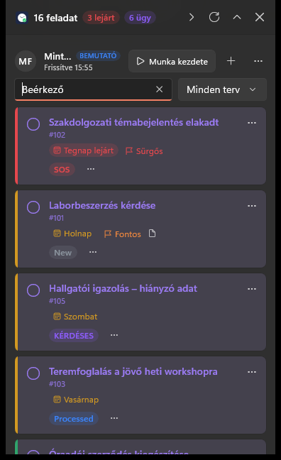

# Planner Widget – telepítés

A Planner Widget egy kis ablak a képernyő jobb felső sarkában, amely a **neked kiosztott Planner-feladatokat** mutatja
határidő szerint, és jelzi a **Beérkező ügyeket** is. A telepítés kb. 2 perc, rendszergazdai jog nem kell hozzá.

## 1. Telepítés

1. Mentsd le a kapott **`PlannerWidget-…-win-x64.zip`** fájlt (pl. a Letöltések mappába).
2. *(Ajánlott)* Kattints a ZIP-re **jobb gombbal → Tulajdonságok**. Ha alul látod a **Feloldás** jelölőnégyzetet,
   pipáld be, majd **OK**. Így a Windows később nem kérdezget.
3. Kattints a ZIP-re **jobb gombbal → Összes kibontása… → Kibontás**. (A Letöltések mappa jó hely; nagyon mélyen
   fekvő mappába ne bontsd ki, mert a Windows a túl hosszú útvonalakat nem tudja kezelni.)
4. A megnyíló mappában kattints duplán a **`Telepites.cmd`** fájlra.
   - Ha kék ablak jön fel („A Windows megvédte a számítógépet”): **További információ → Futtatás mindenképp**.
   - Ha „Biztonsági figyelmeztetés” jön fel: **Futtatás**.
5. Megnyílik egy fekete ablak, és pár másodperc alatt végigfut. Ha a végén zölden azt írja, hogy **Kész!**,
   nyomj meg egy billentyűt az ablak bezárásához.

A widget ezután magától elindul. Később a **Start menüből** vagy az asztali **Planner Widget** ikonnal indíthatod.
A kibontott mappát és a ZIP-et ezután törölheted.

## 2. Bejelentkezés (csak az első alkalommal)

1. Kattints a widgetben a **Bejelentkezés** gombra. Megnyílik a böngésző.
2. Válaszd ki a **munkahelyi Microsoft-fiókodat** (ugyanazt, amivel a Teamsbe vagy az Outlookba lépsz be).
3. Ha első alkalommal egy engedélyt kérő ablak jelenik meg (**„Kért engedélyek”**): **Elfogadás**. A program csak a profilod nevét
   olvassa, és a Planner-feladataidat kezeli.
4. Ha a böngésző kiírja, hogy a bejelentkezés sikerült, a lapot bezárhatod.

A widget pár másodperc alatt betölti a feladataidat. A bejelentkezés megmarad, legközelebb már nem kérdez.

## 3. Mit látsz utána

- **Feladatkártyák** határidő szerint: piros = lejárt, sárga = ma vagy 7 napon belül esedékes, zöld = később esedékes.
- A bal oldali **karikára** kattintva késznek jelölöd a feladatot, a kártya szövegére kattintva megnyílnak a részletei.
- **Halványan lila csempe, lila cím, alatta „#123”:** ez egy beérkező ügy (ticket). A kártya jobb felső **⋯** menüjében
  a **Ticket megnyitása** megnyitja a böngészőben.
- **Az ügy állapota** a színes címke: New (szürke), Processed (kék), In progress (narancs), SOS (piros),
  KÉRDÉSES (lila), Revisit (sárga).
- **Továbblépés: kattints az ügy bal oldali karikájára** – egy kis menü mutatja, mit tehetsz:

  | Állapot | A karika menüjében | Ezután |
  |---|---|---|
  | New (vagy gyűjtő nélkül) | **Átvettem** | Processed |
  | Processed, SOS, KÉRDÉSES | **Elkezdem** | In progress |
  | Revisit – **„Új válasz érkezett”** | **Folytatom** (vagy rögtön **Kész – lezárás**) | In progress (lezárva) |
  | In progress | **Kész – lezárás** | lezárva (Done) |

- **„Új válasz érkezett” (Revisit):** ha egy lezárt ügyre válasz jön, a rendszer magától újranyitja, és sárga
  „Új válasz érkezett” címkével újra megjelenik a listádban (értesítést is kapsz). A karikán a **Folytatom**-mal viheted tovább,
  vagy ha nincs vele több teendő, a **Kész – lezárás**-sal rögtön lezárhatod.
- **Félretétel vagy visszalépés:** az állapotcímke melletti **…** menü: **Sürgős** (SOS), **Kérdéses** (KÉRDÉSES) vagy
  **Vissza New-ba**. Az aktuális állapot menüpontja halvány. (Revisit-et és Done-t nem itt kell állítani: az előbbit
  a rendszer állítja, az utóbbi a „Kész” eredménye.)
- **Ügyet csak In progress (vagy „Új válasz érkezett”) állapotban lehet késznek jelölni** – máskor a karika menüjében a
  „Kész” halvány („előbb kezdd el”).
  **Figyelem:** a lezárással a ticket is lezárul, és a hozzá tartozó e-mailek archiválódnak. Ezt a program előtte
  megkérdezi. Visszanyitni a ticketet a widgetből nem lehet.
- **A Beérkező ügyek lista néhány perc késéssel követi a widgetet** (legrosszabb esetben kb. 10 perc; csak
  hétköznap 7 és 19 óra között). Ha a listában váltanak állapotot, az kb. 1 percen belül a widgetben is látszik.
- **Több felelős esetén egy közös feladat van, a státusz is közös:** ha valaki átveszi vagy elkezdi, a többieknél is
  úgy látszik.
- Fent a fejlécben: hány feladatod van, ebből mennyi lejárt, és hány nyitott ügyed van.
- Új ügy érkezésekor a Windows értesítést küld.
- **Piros ⚠ jel a fejlécben** (szám mellette): a háttérben futó szinkronnak hibája van. Rákattintva látod, melyik
  folyamat hibázott; **Megnyitás** = a részletek a böngészőben, **Megoldva** = lezárod, ha rendben van. Narancs
  **„A szinkron nem fut”** üzenet: a szinkron napközben 20 percnél régebben jelentkezett – szólj a karbantartónak.
  Ha nincs gond, ez a jel nem látszik.
- Az óra melletti **tálcaikonnal** és az **Alt+W** billentyűvel bármikor előhozhatod vagy elrejtheted a widgetet.

### Hogyan kerülnek ide az ügyek?

1. Minden ügy, amelynek van **felelőse** a Beérkező ügyek listában (az automatikusan érkezettek és a kézzel felvettek is),
   Planner-feladatként megjelenik a felelősöknél **New** állapotban – így nálad is, ha te vagy az egyik felelős.
   A karika menüjének **Átvettem** pontjával jelzed, hogy foglalkozol vele.
2. Ha egy ügyről **minden felelős lekerül**, a feladat eltűnik a widgetből. Ha később újra kap felelőst, újra megjelenik.
3. **Felelőst csak a Beérkező ügyek listában vegyél le.** Ha a Plannerben veszed le magad, az nem jut vissza a listába.
   Ezért a widgetben ügyet nem lehet törölni: a kártya jobb felső **⋯** menüjében a **Felelős módosítása…** elmondja ezt,
   és megnyitja a ticketet.

**Hasznos beállítás:** a widget **⋯ → Beállítások…** menüjében kapcsold be az **Indítás a Windows-zal** opciót,
hogy minden bekapcsoláskor magától elinduljon.

A **Munka kezdete** gomb a havi jelenléti ív PDF-jét tölti ki. Ha nem használsz ilyet, nyugodtan hagyd figyelmen kívül.

## 4. Frissítés és eltávolítás

- **Új verzió:** ha új ZIP-et kapsz, ugyanígy bontsd ki, és futtasd a `Telepites.cmd`-t. A beállításaid és a bejelentkezésed
  megmaradnak.
- **Eltávolítás:** a kibontott csomagban az `Eltavolitas.cmd`. A beállításokat nem törli.

## 5. Ha valami nem működik

| Mit látsz | Mit tegyél |
|---|---|
| A bejelentkezésnél **rendszergazdai jóváhagyást** kér | Szólj annak, akitől a programot kaptad (ezt egyszer, központilag kell engedélyezni). |
| „Nincs kapcsolat” | Ellenőrizd az internetet. A widget a legutóbbi állapotot mutatja, és magától újrapróbálja. |
| Nem látod a widgetet | Kattints az óra melletti tálcaikonra (lehet, hogy a **^** nyíl alatt van), vagy nyomd meg az **Alt+W**-t. |
| Nem jelennek meg az ügyek | Csak azok az ügyek látszanak, amelyeknek te vagy a felelőse. |
| Eltűnt egy ügy | A ticketnek most nincs felelőse (vagy másnak osztották ki). Ha újra hozzád kerül, magától visszajön. |
| Levettem magam egy ügyről a Plannerben, mégis visszajött | Felelőst csak a Beérkező ügyek listában lehet módosítani; a Plannerben levett felelőst a folyamat visszaállítja. |
| „A szinkron nem fut (utolsó: …)” | A Power Automate-folyamat leállt; szólj annak, aki a folyamatot karbantartja. |
| Más hiba | Készíts képernyőképet, és küldd el annak, akitől a programot kaptad. |
